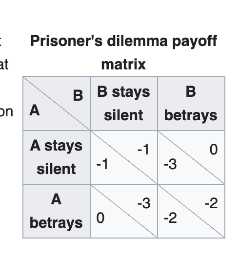

```{r setup, include=FALSE}
knitr::opts_chunk$set(echo = TRUE)
```

#第3章 R Basics  
## 3.1 Package  
安裝package  
```{r}
#install.packages(c("dplyr", "lubridate", "googlesheets4"))
```
啟動package  
```{r}
library(googlesheets4)
library(dplyr)
library(lubridate)
```
***  
## 3.2 Create objects  
```{r}
a <- 2
a = 2 # = 與 <-同義
3 -> b
```
變數命名規則:  
1. 須由字母、數字、點(.)以及底線(_)構成  
2. **開頭必須是字母或是點(但點後不能接數字)**  
辨別變數命名規則  
```{r}
my_108_total_credits <- 15
#_108_total_credits <- 15
#108_total_credits <- 15
#_my_108_total_credits <- 15
my.108.total_credits <- 15
#.108.total_credits <- 15 
.my.108.total_credits <- 15
我的108學年總學分數 <- 15
`我的108學年總學分數` <- 15 # 特殊名稱處理，`不是名稱的一部份
`.108.total_credits` <- 15
```
常見命名方式：  
1. snake: `my_total_credits <- 15`  
2. **camel**: `myTotalCredits <- 15` (推薦使用)  

***  
##3.3 Calling an object  
```{r}
`我的年紀` <- 20
my_age <- `我的年紀`
```
要呼叫某物件時，請先確認Environment裡有該物件存在，或執行**ls()**  
```{r}
ls() #查看Environment裡共有哪些物件存在
```
***  
##3.4 Atomic vector  
```{r}
num1 <- 5
vNum1 <- c(2,5)
vNum2 <- c(2, num1)
```
只有一個值的向量可以不寫`c()`  
以下兩變數值相同:  
```{r}
num1 <- 5
num2 <- c(5)
```
向量的堆疊依然是向量:  
```{r}
vNum1 <- c(-1,5)
vNum2 <- c(2,3)
vNum3 <- c(vNum1,vNum2)
vNum4 <- c(-1,5,2,3)
vNum5 <- c(c(-1,5),c(2,3))
```
vNum3、vNum4、vNum5變數值相同  
```{r}
vNum1 <- c(-1,5)
vNum2 <- c(2,3)
vNum4 <- c() # 空向量
```
  
```{r}
vNum3 <- c(vNum2, vNum1)
vNum4 <- c(vNum4, vNum1) # 向量疊代（recursive vector concatenate）
```
Atomic vector依其值的型態（type）而分成以下三類型:  
1. Numeric  
2. Character  
3. Logical  

### 3.4.1 Numeric  
```{r}
num1<-5 # 非整數
num2<-5L # 整數
num1Vector<-c(5,6,7)
num2Vector<-c(5L,6L,7L)
```
5會被電腦記成5.0000  
5L才會被當成整數5  

### 3.4.2 Character/String (vector)  
在定義object value時，必須要用「成對」的雙引號`"`或單引號`'`，把每個字串括起來  
```{r}
char1<-"你好"
char2<-'你好'
char1Vector<-c("你好","How are you?")
```
使用`class(物件名稱)`查詢上述物件類別  
```{r}
dialogue <- c('小明說："明天不用上課。"', '小花說："真的嗎？"')
#電腦會記錄成"小明說：\"明天不用上課。\"" "小花說：\"真的嗎？\""
cat(dialogue, sep="\n")  # "\n"是指換行
```
R的換行原則是：只要指令定義不全，如括號不成對少右半邊（只有`(`卻沒看到`)`）或結尾是`,` 等等都表示指令不完整，R會再往下一行看，如下一行還是不完整就再往下一行。  

```{r}
library(httr)
library(dplyr)
library(magrittr)
```

```{r error=TRUE}
GET("https://api.github.com/repos/tpemartin/108-2-56-inclass-practice/commits") %>%
  content() %>%
  View()
```
查詢函數用法:  
1. Script window: 游標放在函數名稱任何一個位置，按F1。  
2. Console window: ?函數名稱 按enter。  
3. 右下角Help tab的放大鏡打函數名稱。  
```{r}
#以上對白請把它改成:
#小明說：'明天不用上課。'
#小花說：'真的嗎？'
cat(c("小明說：'明天不用上課。'", "小花說：'真的嗎？'"), sep="\n")  
#以下程式碼中變數出席狀況表單網址缺乏變數值，請貼上本班出席表單網址使該變數值有定義。
library(googlesheets4)
library(httpuv)
```

```{r eval=FALSE}
`出席狀況表單網址` <-  "https://docs.google.com/spreadsheets/d/1EAG49qDKPWWi0ebkVr29TLrvVnoBPfkvxYY-J3xLAHY/edit#gid=458686645"
ss <- as_sheets_id(`出席狀況表單網址`)
homework_sheet <- sheets_read(ss, sheet=1)
```
### 3.4.3 Logical  
邏輯：  
* 為「真」： `T`或`TRUE` (要全大寫)。  
* 為「否」： `F`或`FALSE` (要全大寫)。  
```{r}
logi1 <- c(T,TRUE,F,FALSE,FALSE)
```
邏輯值遇到數學運算時T會被當成1，而F會被當成0
```{r}
# 加總向量內的所有元素值。
sum(logi1)
```
### 3.4.4 `typeof()`  
顯示atomic vector元素的基本認定型態，它代表電腦記憶體在儲存時真正看待的型態。  
```{r}
num <- c(1.5, 2, 3)
int <- c(1L, 3L, -2L)
char <- c("1.5","2","3")
logi <- c(T,T,F)
typeof(num)
typeof(int)
typeof(char)
typeof(logi)
```
### 3.4.5 `class()`
依資料的螢幕顯示型態及能對它進行的操作所做的分類。  
```{r}
class(num)
class(int)
class(char)
class(logi)
```
## 3.5 Atomic Vector Extended  
以下介紹兩個數字串向量而延伸的兩個類別：  

* factor: 類別資料[`factor(字串向量)`]  
* POSIXct/POSIXt: 時間資料[`ymd_hms(字串向量)`]  

### 3.5.1 Factor  
```{r}
# 10位學生的主修科系
majors10_char <- c('經濟學系','社會學系','社會學系','經濟學系','經濟學系','社會學系','經濟學系','經濟學系','經濟學系','社會學系')
typeof(majors10_char)
class(majors10_char)
majors10_factor <- factor(majors10_char)
# 或
majors10_factor <- factor(
  c('經濟學系','社會學系','社會學系','經濟學系','經濟學系','社會學系','經濟學系','經濟學系','經濟學系','社會學系')
)
typeof(majors10_factor)
class(majors10_factor)
```
majors10_char及majors10_factor的螢幕顯示型態是不同的：  
```{r}
majors10_char
majors10_factor
```
`as.integer()`將資料的class轉成integer。由於factor被轉成integer後，其螢幕顯示會顯示電腦是用什麼數字在存這些類別資料。  
```{r}
as.integer(majors10_factor) 
```
數字與類別文字的對照表mapping table:  
```{r}
levels(majors10_factor)
```
Factor屬於atomic vector延伸的類別，其基本儲存型態還是會落在先前的基本型態裡，但多了資料顯示的mapping table。  

### 3.5.2 Class conversion  
R有一系列的`as.{class名稱}()`的函數用來轉換物件的class；`as.{type名稱}()`用來轉換物件的type。  
`as.integer(...)`會將…物件（嘗試）轉成integer class/type的物件。例如：  
```{r}
stringInteger <- c("1","2","-11")
class(stringInteger) # 無法進行數值運算
```
```{r error=TRUE}
stringInteger+2
```
```{r}
trueInteger <- as.integer(stringInteger)
class(trueInteger) # 可以進行數值運算
typeof(trueInteger)
trueInteger+2
```
```{r}
char3 <- c("小明","1","3")
as.integer(char3) #因為"小明"無法轉換為numeric形式，故硬是轉換下會變成NA
```
R的函數均不會主動更改輸入物件，只會把結果值另行輸出，所以若要保留轉換結果則必需指定到一個物件名稱上。
```{r}
stringInteger <- as.integer(stringInteger)
class(stringInteger)
```
```{r}
#以下為學生學號
studentId <- c(410773002, 410773015)
#它目前是什麼class
class(studentId)
#學號用什麼class比較合理
studentId <- as.character(studentId)
class(studentId)
```
### 3.5.3 Date/Time
處理時間所需資訊：  
* 時間輸入方式  
* 時間來自時區  
* 時間儲存以哪個時區為準（進行比較用）  
其中最後一點通訊協定是採UTC時區為公定標準，故不用煩惱。  
```{r}
library(lubridate)
```
#### 3.5.3.1 台北  
2020-03-18 13:52:40  
* 時間輸入方式: ymd_hms
* 時間來自時區: Asia/Taipei
```{r}
tpeTime <- ymd_hms("2020-03-18 13:52:40", tz="Asia/Taipei")
```
我們使用lubridate中的ymd_hms函數有以下兩種做法：  
1. 作法一：使用library()
```{r}
library(lubridate)
tpeTime <- ymd_hms("2020-03-18 13:52:40", tz="Asia/Taipei")
```
2. 作法二：不使用library()
```{r}
tpeTime <- lubridate::ymd_hms("2020-03-18 13:52:40", tz="Asia/Taipei")
```
#### 3.5.3.2 葡萄牙
Mar.18, 2020, 05:52:40  
* 時間輸入方式: mdy_hms  
* 時間來自時區: Europe/Lisbon  
```{r}
pgTime <- mdy_hms("Mar.18, 2020, 05:52:40", tz="Europe/Lisbon")
```
來自相同時區、相同輸入方式的時間文字字串，可以直接套入相同函數轉成Date/Time類別。
```{r}
tpeTime <- c("2020-03-18 13:52:40", "2020-03-11 03:12:40")
tpeTime <-ymd_hms(tpeTime, # 呼叫tpeTime向量值
    tz="Asia/Taipei")
```
相當於
```{r}
tpeTime <- 
  ymd_hms(c("2020-03-18 13:52:40","2020-03-11 03:12:40"), tz="Asia/Taipei")
```
若時間字串來自UTC，那可以不設定tz參數，即
```{r}
ymd_hms(c("2020-03-18 13:52:40","2020-03-11 03:12:40"))
```
若時間字串長得像“2020-03-11T06:56:17Z”，它來自UTC時區：
```{r}
ymd_hms("2020-03-11T06:56:17Z")
```
```{r  eval=FALSE}
browseURL("https://docs.google.com/spreadsheets/d/1EAG49qDKPWWi0ebkVr29TLrvVnoBPfkvxYY-J3xLAHY/edit#gid=458686645")
```
```{r}
studentTime <- c( ymd_hms("2020-03-04T06:56:29Z"),
               ymd_hms("2020-03-11 14:16:43", tz="Asia/Taipei"),
               ymd_hms("2020-03-11 14:34:33", tz="Asia/Taipei")
               )
studentTime
```
#### 3.5.3.3 以某個時區顯示  
以UTC表示  
```{r}
with_tz(tpeTime, tzone="UTC")
with_tz(pgTime, tzone="UTC")
```
以Europe/Paris表示  
```{r}
with_tz(tpeTime, tzone="Europe/Paris")
with_tz(pgTime, tzone="Europe/Paris")
```
```{r}
with_tz(studentTime, tzone = "Europe/Paris")
```
#### 3.5.3.4 type  
```{r}
class(tpeTime)
typeof(tpeTime)
as.numeric(tpeTime)
as.numeric(pgTime)
```
Date/Time的儲存其實是數值，它的原點是UTC時區的1970-01-01 00:00:00。 as.numeric(tpeTime)的值顯示tpeTime離那個原點已過了多少秒。
```{r}
#數於Date/Time class的向量內容是數值，所以它是可以做數值相減。請問台北“2020-03-11 12:55:30”與巴黎“2020-02-13 15:33:10”相減後會出現什麼？
ymd_hms("2020-03-11 12:55:30", tz="Asia/Taipei")-ymd_hms("2020-02-13 15:33:10", tz="Europe/Paris")
```
## 3.6 List  
特色：  
1. 每個元素值可以是不同type的物件值。
```{r}
`小明交易1` <- list(`時間`=ymd_hms("2020-03-31T13:40:55Z"),
                `飲料店`="一芳",
                `數量`=2,
                `飲料`="水果茶")
print(`小明交易1`)
```
2. 物件值可以是vector形式，也可以list。  
```{r}
# list含兩個vectors
`小明108學年課表A` <- list(
  c("108-1","高級會計學","高等統計學"),
  c("108-2","食在拉丁美洲")
)
print(`小明108學年課表A`)
# list含兩個lists
`小明108學年課表B` <- list(
  list("108-1","高級會計學","高等統計學"),
  list("108-2","食在拉丁美洲")
)
print(`小明108學年課表B`)
# list含兩個lists, 子層list又各含兩個vectors
`小明108學年課表C` <- list(
  list(
    c("108-1"), # 可只寫 "108-1"
    c("高級會計學","高等統計學")
       ),
  list(
    c("108-2"),
    c("食在拉丁美洲")
  )
)
print(`小明108學年課表C`)
```
3. 物件值可以取名。
```{r}
`小明108學年課表D` <- list(
  `108學年第1學期`=list(
    c("108-1"), # 可只寫 "108-1"
    c("高級會計學","高等統計學")
       ),
  `108學年第2學期`=list(
    c("108-2"),
    c("食在拉丁美洲")
  )
)
print(`小明108學年課表D`)
```
```{r}
commit <- list(
  author=list(
    name="Martin老師",
    email="mtlin@gm.ntpu.edu.tw",
    date=ymd_hms("2020-03-25T07:17:40Z")
  ),
  comitter=list(
    name="emilyluckey",
    email="emily007@gmail.com",
    date=ymd_hms("2020-03-26T08:18:40Z")
  ),
  message="update"
)
print(commit)
```
網路上的資料回傳大部份時候長得像list的格式。這種回傳資訊格式叫做**JSON**(JavaScript Object Notation)，每個程式語法都會準備一個物件形式用來儲存接收到的JSON資料；R會用list type，Python會用dictionary type。  
也因為每個程式都可接收JSON形式資料，不同程式開發者若有必要進行網路資訊交換時會將複雜資料結構轉成JSON再交換出去。  
我們的程式要在網路送出commit資訊時，可以透過以下程序將list轉成JSON：
```{r}
library(jsonlite) # 不少同學這行會有Error，還記得如何排除嗎？
toJSON(commit)
```
```{r}
#學生小明，在108學年第1學期修了Alice老師所授的個體經濟學（得分85分）、Mark老師所授的總體經濟學(得分73分)。在108學年第2學期修了Jason老師所授的作業研究（得分90分）。
`小明的修課記錄` <- list(
  name="小明",
  semesters=list(
    `108-1`=list(
      course1_1081=list(
        name="個體經濟學",
        teacher="Alice",
        grade=85
      ),
      course2_1081=list(
        name="總體經濟學",
        teacher="Mark",
        grade=78
      )
    ),
    `108-2`=list(
      course1_1082=list(
        name="作業研究",
        teacher="Jason",
        grade=90
      )
    )
  )
)
print(`小明的修課記錄`)
```
```{r}
#今（“2020-03-31”）明（“2020-04-01”）「台北市」氣溫最高25度，最低18度；「新北市」氣溫最高24度，最低15度。
temperature <- list(
  date=list(today=ymd("2020-03-31"),tomorrow=ymd("2020-04-01")
  ),
  location=list(
    taipei=list(high=25,low=18),
    newtaipei=list(high=24,low=15)
  )
)
print(temperature)
```
game的定義： A game involves three components:
1. A list of players
2. Moves each player can make (strategies)
3. A listing of payoffs, or benefits, for each player on each eventual outcome (a utility function for outcomes)
  
```{r}
game=list(
  players=list(player1="A",player2="B"),
  strategies=list(
    player1=list(strategy1="stay_silent",strategy2="betray"),
    player2=list(strategy1="stay_silent",strategy2="betray")
  ),
  `payoffs: (player1, player2)`=list(
    # mapping from all possible player1 strategy vs player2 strategy
    player1=list(
      strategy1=list(
        player2=list(strategy1=c(-1,-1),strategy2=c(-3,0))
      ),
      strategy2=list(
        player2=list(strategy1=c(0,-3),strategy2=c(-2,-1))
      )
    )
  )
)

# 查詢strategies
game$strategies$player1$strategy1
game$strategies$player2$strategy2

# 查詢payoffs
## player1:strategy1, player2:strategy2
game$`payoffs: (player1, player2)`$player1$strategy1$player2$strategy2
## player1:strategy2, player2:strategy2
game$`payoffs: (player1, player2)`$player1$strategy2$player2$strategy2
```
## 3.7 物件儲存
* 存下Global Environment中有的物件：
`save(object1, object2, ..., file="myData.Rda")`
* 下次取回來Global Environment用：
`load("myData.Rda")`

```{r}
object1 <- c(2,5)
object2 <- ymd_hms(
  c("2015-03-22 12:28:42","2017-12-22 15:33:48"),
  tz="Asia/Taipei"
)
object3 <- list(2, FALSE, c("a","b","c"))
save(object1, object2, object3, file="threeObjects.Rda")
```
```{r}
load("threeObjects.Rda")
```


